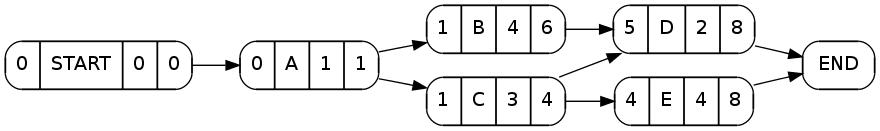
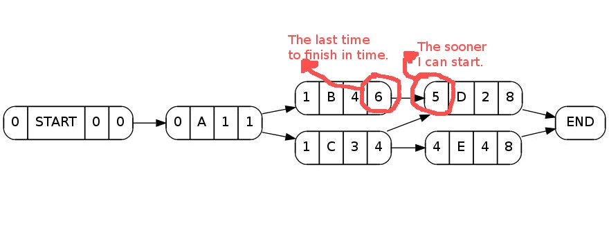

# Pert

Creates an evaluated PERT diagram in dot language whenever 
you provide a list of tasks.

## Installation
Now:

Clone the repos and run (see below).

In a near feauture:

Add this line to your application's Gemfile:

    gem 'pert'

And then execute:

    $ bundle

Or install it yourself as:

    $ gem install pert

## Usage

    $ bundle exec bin/pert <file>

One example file is provided. To see it type:

    $ budle exec bin/pert examples/pert.diag

If you want to see an image, then:

    $ budle exec bin/pert examples/pert.diag | dot | display

   Remember to install graphviz and imagemagick.

## Example

There are two examples under the examples directory. In pert.diag we can read:

    # name_of_node, previous_nodes, ..., duration
    A, - , 1    # A dash indicates no dependency
    B, A , 4    # Node B, needs A to be finished, and takes 4 time units to end.
    C, A , 3
    D, B, C, 2  # Node D depends on B and C.
    E, C, 4

Running:

    $ pert examples/pert.diag | dot | display

we come to:

There we see the name of the task followed by its duration.
The sooner I can start a task and the last for ending it are 
calculated by the gem. See the next picture:

## Contributing

1. Fork it
2. Create your feature branch (`git checkout -b my-new-feature`)
3. Commit your changes (`git commit -am 'Added some feature'`)
4. Push to the branch (`git push origin my-new-feature`)
5. Create new Pull Request
